footer: © 2017, Arthur Ariel Sabintsev.<br>ArtSabintsev on [Twitter](https://twitter.com/ArtSabintsev) & [Github](https://github.com/ArtSabintsev).
autoscale: true
slidenumbers: true
theme: Plain Jane, 1

<!-- BEGIN TALK -->
# How Open Source Software Development Can Make You a Better Developer
### Arthur Sabintsev<br>Lead iOS Developer<br>The Washington Post

---

> "Open source software is software with source code that anyone can inspect, modify, and enhance."
-- OpenSource.com

^ Ask people if they've ever contributed OSS? Monthly? Weekly?. First part of the talk geared towards junior devs and those who are too scared to contribute to OSS.

---

# OSS Résumé

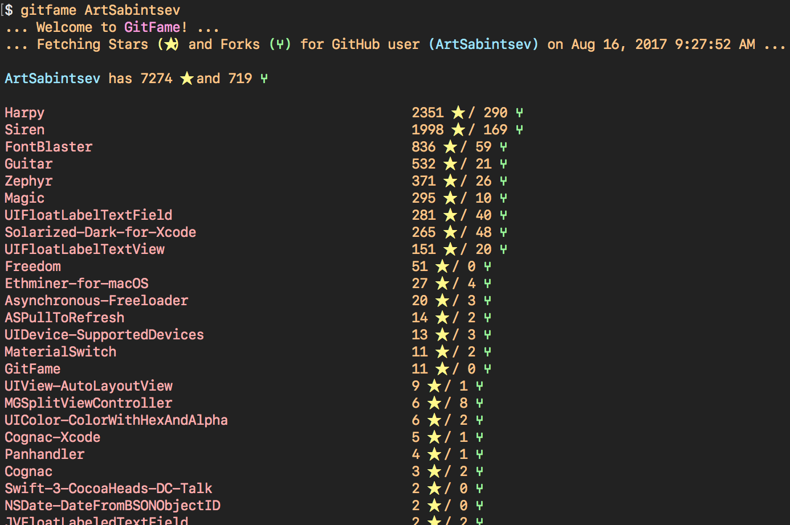

- 1.3 million+ downloads via CocoaPods[^1]
- 7,200+ stars on GitHub[^2]
- Contributed to Swift 3.1[^3]
- Contributed to Swift Source Compatibility[^4] [^5]

Stats on the right generated by GitFame[^6]

[^1]: [CocoaPods Stats for ArtSabintsev](https://cocoapods.org/owners/2166)

[^2]: [GitHub Account for ArtSabintsev](https://github.com/ArtSabintsev)

[^3]: [XCTAssertNoThrow Implementation for Swift 3.1](https://github.com/apple/swift/pull/6776)

[^4]: [Guitar: Platform-Independent Regular Expression and String
 Library](https://github.com/ArtSabintsev/Guitar)

[^5]: [Swift Source Compatibility Suite](https://swift.org/source-compatibility/)

[^6]: [GitFame: Swift CLI Script That Logs GitHub Stars and
 Forks.](https://github.com/ArtSabintsev/GitFame)

^ Mentioning not having CS knowledge is important to Junior Developers

---

> You don't need a computer science degree to contribute to Open Source.
-- Lesson #1

---

[.build-lists: true]

## 4 Types of Open-Source Projects Based on Adoption[^7]

1. No Adoption
2. Adoption
3. Gold Standard
4. Hyper-Scale

[^7]: [Feilx Krause's Four Stages of Open Source Projects](https://news.realm.io/news/tryswift-felix-krause-scaling-open-source-communities-github-management/)

---

[.build-lists: true]

# Journey into the past, to a time before

- **JSON Parsing libs** (Argo, Gloss, SwiftyJSON, etc.)
- **Auto Layout libs** (PureLayout, SnapKit, Stevia, etc.)
- **Async. Image Downloading libs** (Kingfisher, SDWebImage, etc.)
- Journey back to the days of **Pull to Refresh**!

^ Created by Loren Brichter for Tweetie 2.0. Twitter acquired Tweetie, and Open Sourced the patent.

---

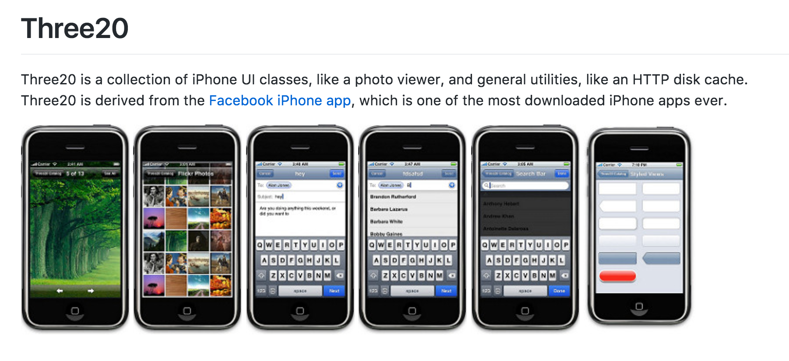

^ Stopped Development mid-2012, well before iOS 6 was released.
^ Needed a replacement for Three20 implementation of Pull-to-Refresh.

---

## **Drive+** by Porsche & **Ducati Community** for Ducati

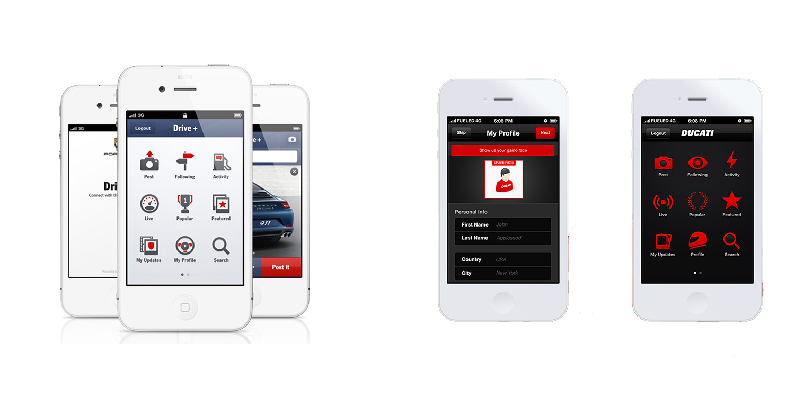

^Porsche & Ducati Apps I Build for Fueled.com
Same exact app with multiple screens that needed Pull-To-Refresh with an onRefresh completion method.

---

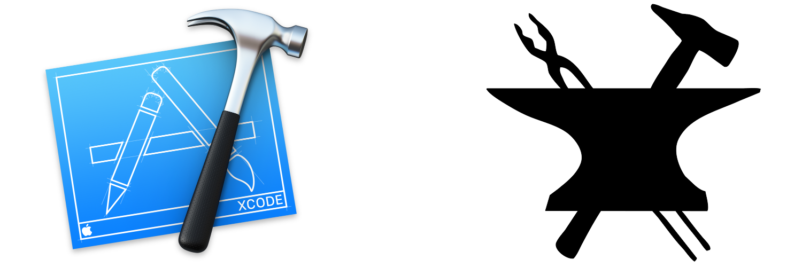

> Programmers are like Blacksmiths, we create our own tools.
-- Lesson #2

^ Mathematicians

---

> Gumption
-- Lesson #3

---

# The Float Label Pattern [^8] [^9] [^10]


[^8]: [The Float Label Pattern by Matt D. Smith](http://mds.is/float-label-pattern/)

[^9]: [UIFloatLabelTextField](https://github.com/ArtSabintsev/UIFloatLabelTextField)

[^10]: [UIFloatLabelTextView](https://github.com/ArtSabintsev/UIFloatLabelTextView)

---

# Swizzling UITextField's Clear Button

```objc
- (void)setuptextFieldClearButton
{
    // A boolean that toggles the state of the keyboard after the clear-text button is pressed.
    _dismissKeyboardWhenClearingTextField = @NO;

    // Create selector for Apple's built-in UITextField button - clearButton
    SEL clearButtonSelector = NSSelectorFromString(@"clearButton");

    // Reference clearButton getter
    IMP clearButtonImplementation = [self methodForSelector:clearButtonSelector];

    // Create function pointer that returns UIButton from implementation of method that contains clearButtonSelector
    UIButton * (* clearButtonFunctionPointer)(id, SEL) = (UIButton *(*)(id, SEL))clearButtonImplementation;

    // Set textFieldClearButton reference to "clearButton" from clearButtonSelector
    _textFieldClearButton = clearButtonFunctionPointer(self, clearButtonSelector);

    if (_textFieldClearButton) {
        // Remove all textFieldClearButton target-actions (e.g., Apple's standard clearButton actions)
        [self.textFieldClearButton removeTarget:nil action:NULL forControlEvents:UIControlEventAllEvents];

        // Add new target-action for textFieldClearButton
        [_textFieldClearButton addTarget:self action:@selector(clearTextField) forControlEvents:UIControlEventTouchUpInside];
    }
}
```

---

## Experimenting with APIs You Normally Wouldn't Use [^11]

```swift
    /// Returns the latinized version of the string without diacritics.
    ///
    ///     let string = "Hello! こんにちは! สวัสดี! مرحبا! 您好!"
    ///     print(string.latinized())
    ///     // Prints "Hello! kon'nichiha! swasdi! mrhba! nin hao!"
    ///
    /// - Returns: The latinized version of the string without diacritics.
    @discardableResult
    func latinized() -> String {
        #if !os(Linux)
            if #available(iOS 9.0, macOS 10.11, tvOS 9.0, watchOS 3.0, *) {
                return (applyingTransform(.toLatin, reverse: false) ?? self).withoutAccents()
            } else {
                assertionFailure("The latinized function is only available iOS 9.0+, macOS 10.11+, tvOS 9.0+, and watchOS 3.0+")
                return self.withoutAccents()
            }
        #else
            assertionFailure("The latinized function is only available for Darwin devices; iOS, macOS, tvOS, watchOS")
            return self.withoutAccents()
        #endif
    }
```

[^11]: [Guitar](https://github.com/ArtSabintsev/Guitar)

---

> Learn and experiment with language and platform APIs that you normally wouldn't in your day job.
-- Lesson #4

---

# Harpy & Siren

#### Checks currently installed version of your app against the version that is available in the App Store.

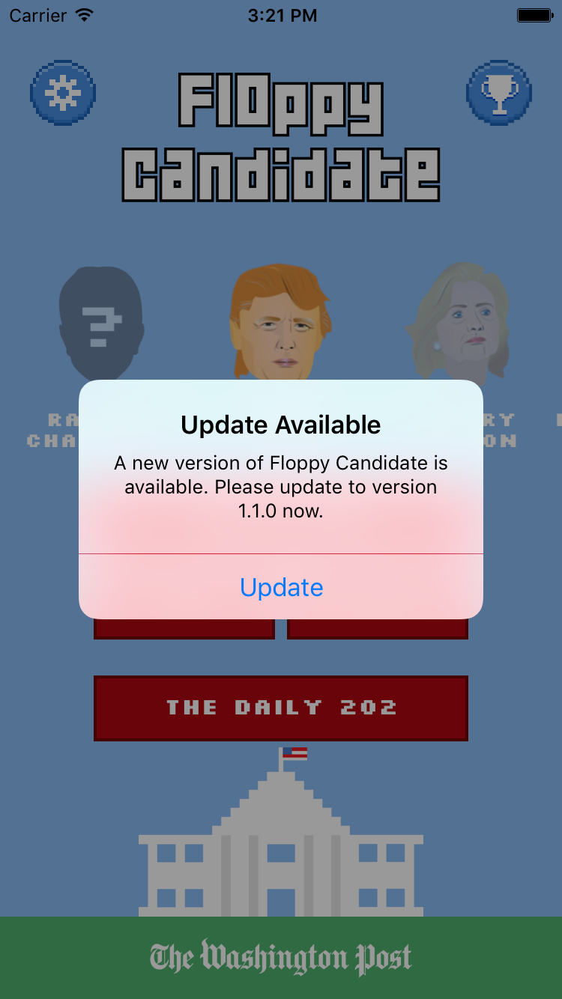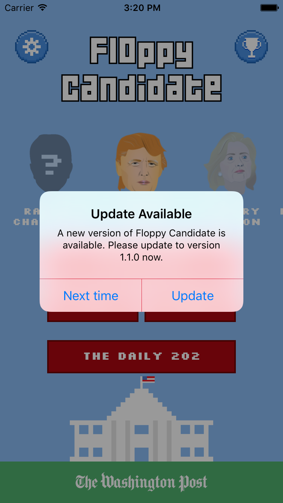

^ Localized for 40 Languages. Conditional presentation depending on device and current installed version of iOS. Delegate methods for analytics or to present your own localized alert.

---

# Package Managers

- CocoaPods
- Carthage
- Swift Package Manager

---

# Continuous Integration

- BuddyBuild.com / Travis CI
- YAML Files
- Pre-Install & Post-Install Scripts

---

# Internationalization (i18n) & Localization (l10n)

- Adding ability to be used across Languages
  -  NSLocalizedString, Custom Bundles
  - Localized for 40 Languages.
- Overriding iOS-system-level localization

---

# Being a Maintainer vs. Being a Consumer

- I _rarely_ use Harpy and Siren
  -  80,000+ combined monthly downloads
- Consumers:
  - Report when the projects stop working
  - Request features
  - Add features via PRs

^ Feature requests: Ability to show custom UI alerts

---

> Maintaining an Open Source project is both a rewarding and thankless **job**.
-- Lesson #5

^ You need to find a reason to continue maintaining a project once you've stopped being its primary consumer.

---

# How to Contribute to Open Source

---

# Contributing to Swift

- Search [bugs.swift.org](https://bugs.swift.org/browse/SR-5615?jql=status%20%3D%20Open%20AND%20labels%20%3D%20StarterBug) for **StarterBug** issues that are **Open**.

- Search the Swift and Corelibs repositories for
 - `NSUnimplemented()`
 - `// FIXME: Unsupported`

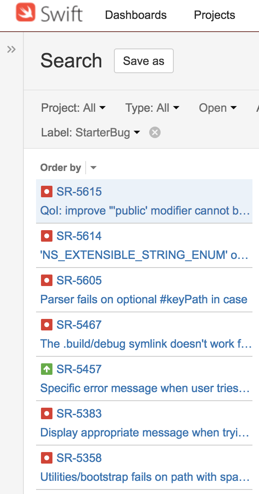

---

# Contributing to Established Projects (1/2)

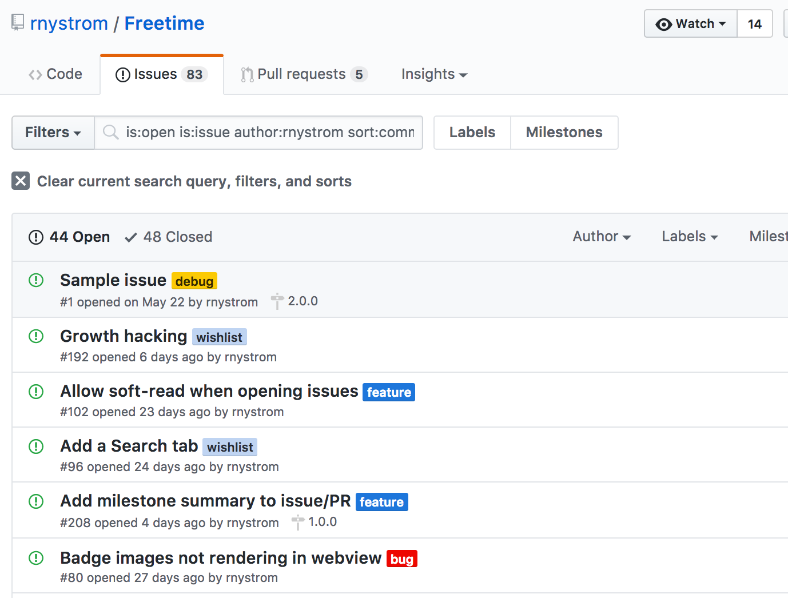

- Issues posted by the maintainer

---

# Contributing to Established Projects (2/2)

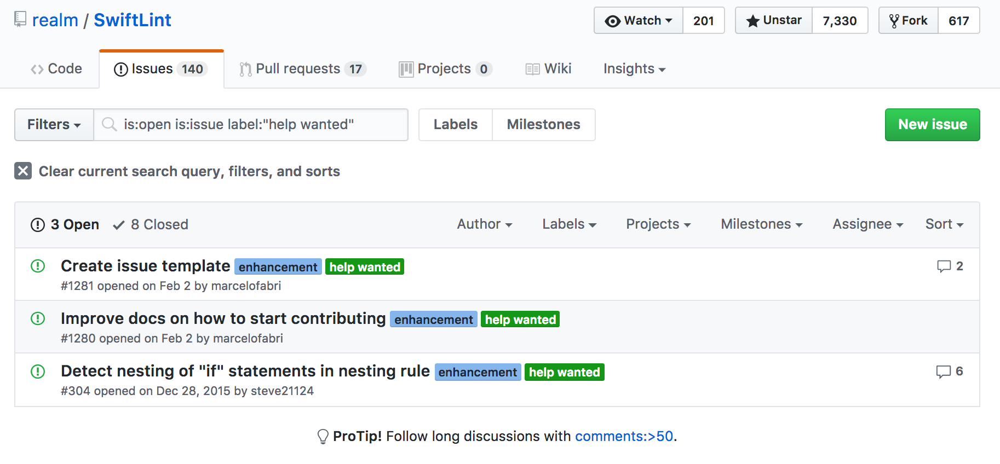

- Look at labels:
 - `starter task`
 - `help`
 - `feature`
 - `bug`

- Help me implement a rule in SwiftLint!
 - [SwiftLint#1315](https://github.com/realm/SwiftLint/pull/1315)

---

# Creating Your Own Project

- Add a README
- Document every line of `public` code
  - Document `private` code as necessary
- Add Documentations using [Jazzy](https://github.com/Realm/Jazzy)
- Add Tests and hook up to Continuous Integration
- Add a document describing the Vision (e.g., `VISION.md`)
- Add issues delineating future features
  - Mark some with labels, like `Starter Tasks`

---

# Marketing your Library

- Submit to Mailing Lists
  - [iOS Dev Weekly](https://iosdevweekly.com/) - Dave Verwer, Evan Dekhayser, Vicc Alexander
  - [This Week in Swift](https://swiftnews.curated.co/) - Natasha The Robot
  - [iOS Goodies](http://ios-goodies.com/) - Rui Peres & Tiago Almeida
  - [Lil' Bites of Cocoa](littlebitesofcocoa.com) - Jake Marsh
  - [iOS Cookies](http://www.ioscookies.com/) - Adam Bardon
  - [Swift Weekly](http://swiftweekly.com/) - 9Elements
  - [Swift Developments](https://andybargh.com/swiftdevelopments/) - Andy Bargh
- Twitter
  - #swiftlang, #iosdev

---

# Maintenance Tips & Tricks

---

# Issue Templates

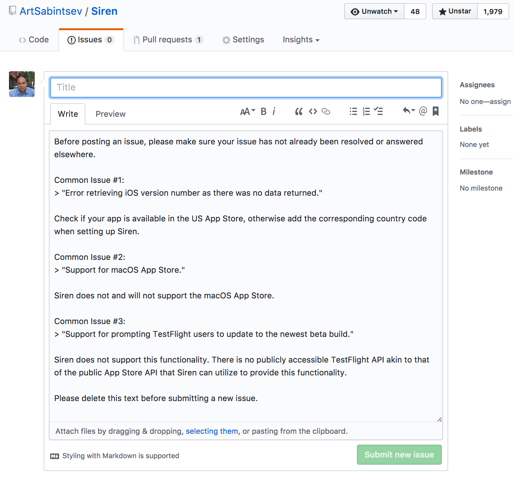

- Pre-populate the **New Issue** screen with information that informs people about previously answered questions.

- Located at `/path/to/project/.github/ISSUE_TEMPLATE.md`

---

# Pull Requests vs. Issues

### Turn off issues in favor of pull requests[^13]

PRs require the consumer to (at the very least):

- RTFM.
- Provide sample code for a feature.
- Attempt fixing a bug.
- Understand how to _fork_ a GitHub project and open a PR.

[^13]: [Turning Off Github Issues](https://gist.github.com/ryanflorence/8a62abea562ca2896dee)

^ RTFM forces you to write good documentation.

---

# The 5 Day Rule

## If a consumer opens an Issue/PR, but does not follow up to your questions/comments within **5 work days**, close the Issue/PR and move on.

---

# Network of Trust

> ...built on a network of trust among developers that have come to know each other over the years. There’s no way I can test all the platforms we support – the same way there is no way I can check every single commit that gets merged..."
-- Linus Torvalds[^14]

[^14]: [Video: Linus Torvalds on How to Build a Successful Open Source Project](https://www.linux.com/news/event/open-source-leadership-summit/2017/2/video-linus-torvalds-how-build-successful-open-source-project)

^ Linux has thousands of contributors (sometimes for each release). Network of trust exists. Takes pressure off you to review/merge/release

---

# Deprecating A Project

- Update the README
- Remove the codebase from the final commit

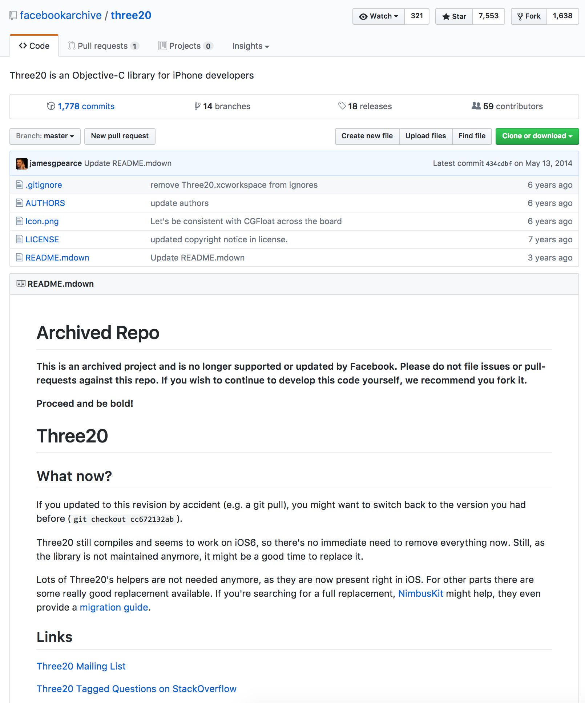

---

# Passing the Torch

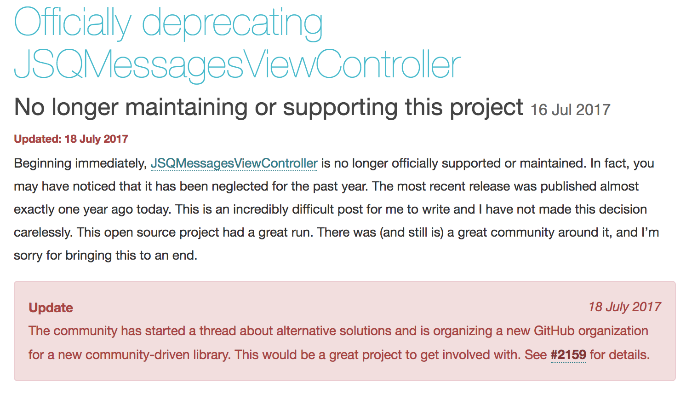

- Jesse Squires recently deprecated [JSQMessagesViewController](https://github.com/jessesquires/JSQMessagesViewController)[^15]
- [MessageKit](https://github.com/MessageKit) is a community effort to support a rewritte Swift version of the library

[^15]: [Officially Deprecating JSQMessagesViewController Blog Post](https://www.jessesquires.com/blog/officially-deprecating-jsqmessagesviewcontroller/)

---

# Final Words of Advice

---

# From The Shark Tank

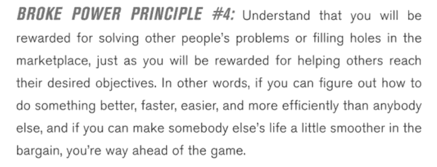

^ Open Source opened doors to for me.

---


^ From XKCD

---

# Thank You!

### [https://github.com/ArtSabintsev/360iDev-2017](https://github.com/ArtSabintsev/360iDev-2017)
